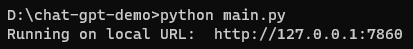

# ChatGPT Python Demo

This application was built to learn and demonstrate on how to use the ChatGPT model API made available by OpenAI.<br/>
This isn't supposed to be a fully fledged chatbot so keep that in mind but if this still does pique your interest and you want to run it then you can follow the steps as follows.

## Steps to run
1. You will need [Python](https://www.python.org/) to be able to run this script. So make sure you have that.
2. After installing python, you will need to install the dependencies.
Run the following command:
    ```
    pip install -r requirements.txt
    ```
3. Get your OpenAI API key (if you don't already have one then [click here](https://platform.openai.com/account/api-keys)). Then copy the API key and paste it in [openai_api_key.txt](./openai_api_key.txt)
4. Now run [main.py](./main.py) and forget about it (Actually no, it will give you a link which you need to open in the browser.)

5. Now you can add a context to the chat if you want to talk about something specific or just chat normally.

Thank you!